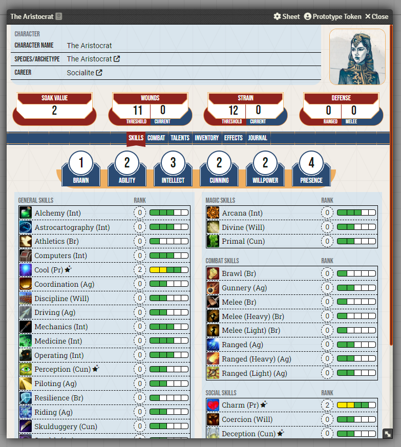
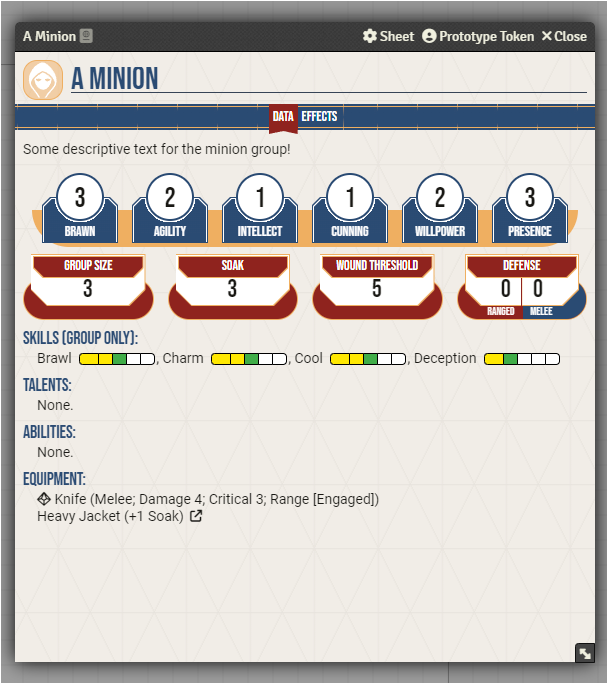
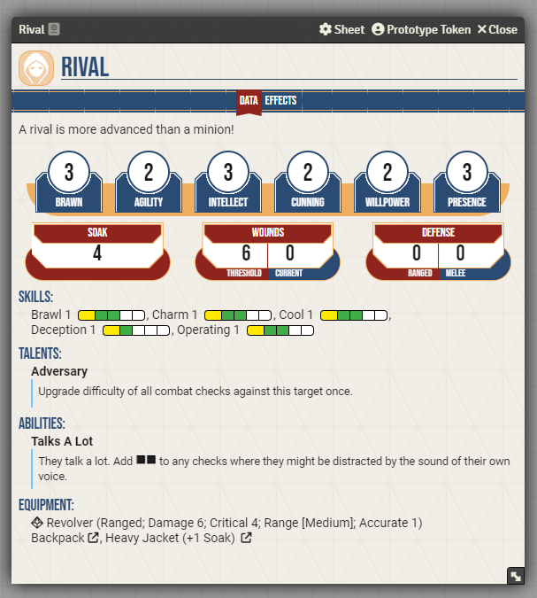
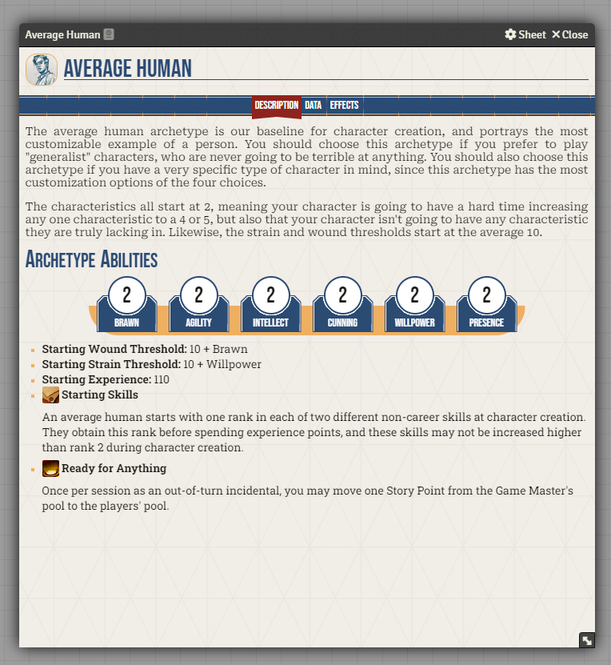

# FVTT Genesys
An implementation of [EDGE Studio](https://edge-studio.net/)'s Genesys roleplaying game.

## Screenshots
#### Character Sheet

#### Minion Sheet

#### Rival Sheet

#### Archetype Sheet

## Contributing
All pull requests and forks must adhere to the following:
- Respect the FontAwesome licensing. If you don't have a seat on a FontAwesome license, do not use FontAwesome Pro icons in your contributions.
- If adapting code from other sources, you must update the "Further Licenses" section below to indicate its licensing and include an appropriately-placed license file where applicable.
- All contributions to this project, unless otherwise noted through licenses as mentioned above, fall under the project's MIT License.
- AI-generated code contributions are not permitted under any circumstances.
- Contributors who act in a bad faith, hateful, or otherwise harmful manner will be blocked from making future contributions. This includes notable behavior outside this system and its community.

## License
Code for this system is licensed under the [MIT License](https://mit-license.org/), see [LICENSE](LICENSE).

### Further Licenses
Some components of this project are used under alternative licensing terms. Each of these components will be accompanied by its own nearby LICENSE file, and is noted below:

#### ⚠️ FontAwesome ⚠️
> **License:** [Proprietary](https://fontawesome.com/license)
>
> There are a couple of important nuances to use of FontAwesome in this project.
>
> 1) The official FoundryVTT has a license to use and distribute FontAwesome Pro icons within their software. To my knowledge and based on information shared in the [FoundryVTT Discord Server](https://discord.gg/foundryvtt), this ***does not*** include systems developed for Foundry by third-party creators.
> 2) This system makes use of the FontAwesome Pro icons packaged with Foundry VTT. *This is allowable only because I have a FontAwesome Pro license.* No other seats are provided for contributors at this time.
>
> This means:
> 1) Contributors should not make use of FontAwesome Pro icons in the code they contribute to the project (because FontAwesome licenses are based on individual seats) unless they have a seat on a FontAwesome Pro license.
> 2) If you fork this project, you are responsible for either removing all uses of FontAwesome Pro icons, or purchasing an appropriate license.

#### Foundry Type Data
> Foundry type data was initially pulled from the [Pathfinder 2E System](https://github.com/foundryvtt/pf2e), and has been modified in multiple places to suit the needs of this project.
>
> **License:** [Apache 2.0](types/foundry/LICENSE)

#### Fonts: Bebas Neue, Roboto Serif, Roboto Slab, Roboto Mono
> **License:** [Open Font License](assets/fonts/OFL.txt)

#### Font: Roboto
> **License:** [Apache 2.0](assets/fonts/Roboto/LICENSE.txt)

#### Font: Roboto Condensed
> **License:** [Apache 2.0](assets/fonts/Roboto_Condensed/LICENSE.txt)

#### Font: Genesys Glyphs & Dice
> **License:** [MIT](assets/fonts/FFG-Genesys-Glyphs-and-Dice/LICENSE)
>
> https://github.com/themensch/FFG-Genesys-Glyphs-and-Dice

#### Font: Genesys Glyphs & Dice (Magical Girl Theme)
> Symbols provided by and used with permission from [MilkMyth](http://MilkMyth.com)!

#### Vue 3
> **License:** [MIT](https://github.com/vuejs/core/blob/main/LICENSE)

#### Vue-Masonry-Wall
> **License:** [MIT](https://github.com/DerYeger/yeger/blob/main/packages/vue-masonry-wall/LICENSE)
